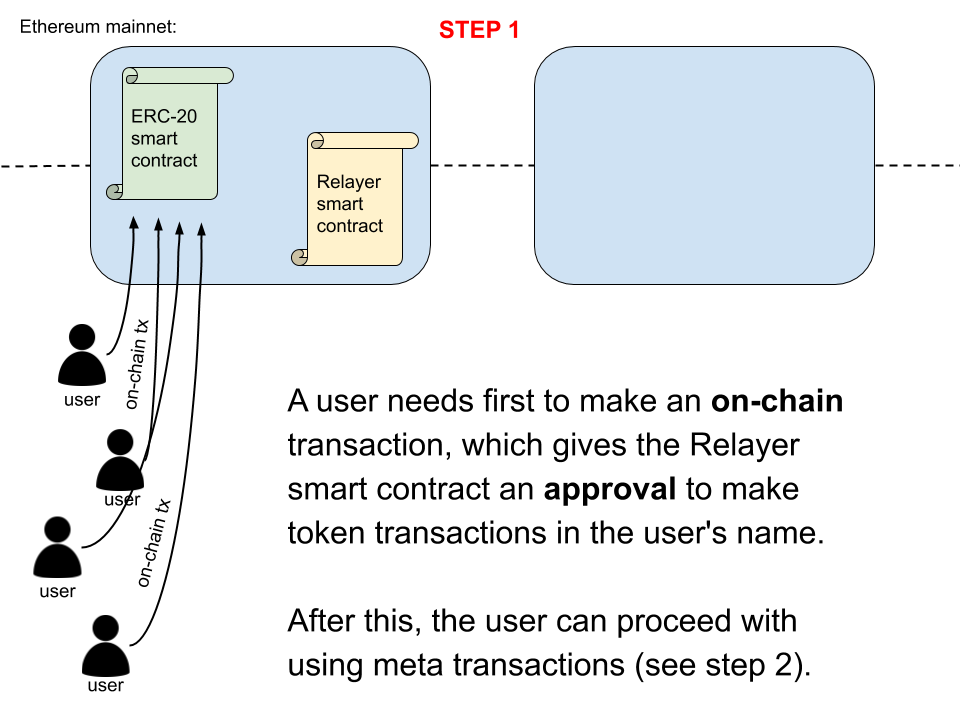
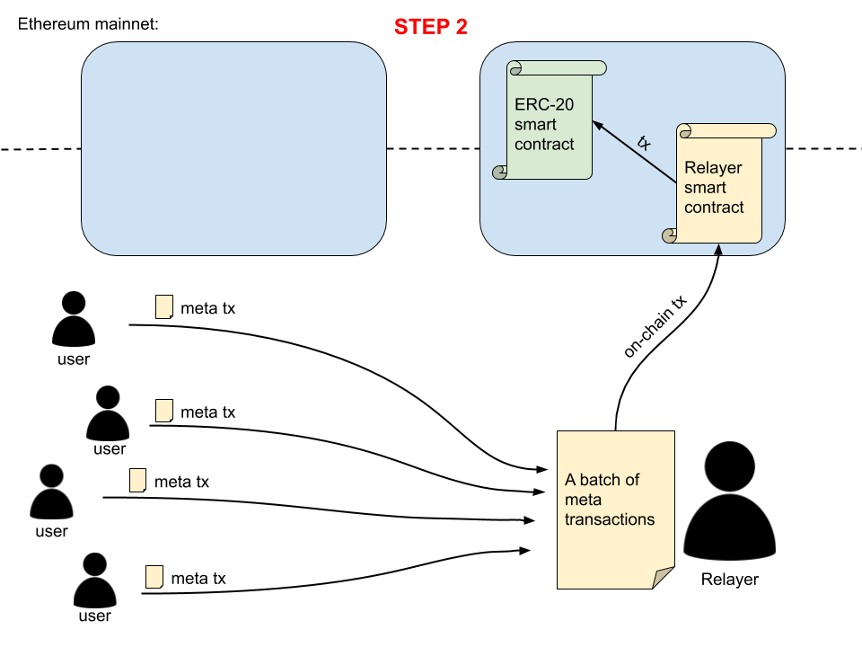
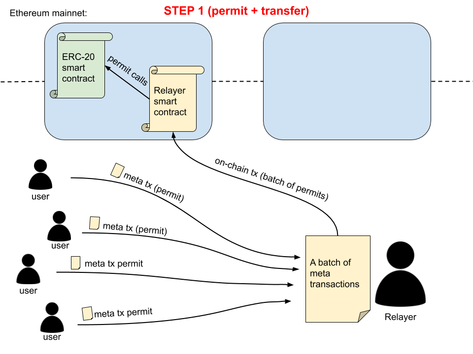

# A relayer smart contract

A smart contract that processes meta transactions. Does not require token smart contracts to upgrade.

> **Important:** This smart contract does not need the [ERC20MetaBatch standard](https://github.com/defifuture/erc20-batched-meta-transactions) to operate. Instead, it relies on having an approval to spend user's tokens.

## Implementation

### Without `permit()`

If a token contract does not have the `permit()` function (see [EIP-2612: permit – 712-signed approvals](https://eips.ethereum.org/EIPS/eip-2612)), then a user would need to first give the smart contract a on-chain permission to spend their tokens:

The disadvantage of this process is that a user first needs to do an on-chain transaction, before being able to do off-chain meta transactions. 

But luckily, the on-chain transaction needs to be made only once per token (if the allowance amount is unlimited, of course).

### With `permit()`

`permit()` is a very nice function that provides a new functionality to the ERC-20 standard - Basically it means that a user can give a **token-spending approval** to someone else using a **meta transaction** (off-chain). 

This solves the problem from the **previous chapter** (a user having to make an on-chain approval transaction first).

> For more information see [EIP-2612: permit – 712-signed approvals](https://eips.ethereum.org/EIPS/eip-2612).

There are two ways of using permits:

- Sending a permit meta tx and a transfer meta tx in **two separate** on-chain txs
- Sending a permit meta tx and a transfer meta tx in **the same** on-chain tx

More often it would be better to do it in a single on-chain tx (lower tx cost), but there may be cases where two separate on-chain txs make more sense.

#### Two separate transactions (1. permit, 2. transfer)

#### Single transaction (1. permit & transfer)

## Security considerations

### Interest-bearing tokens

Lending platforms (like Aave and Compound) give you an interest-bearing token when you deposit some (approved) ERC-20 token with them.

It should be researched who receives an interest-bearing token in case the deposit is made as a meta transaction via a relayer. It shouldn't happen that the relayer would receive the interest-bearing token instead of the meta tx sender.